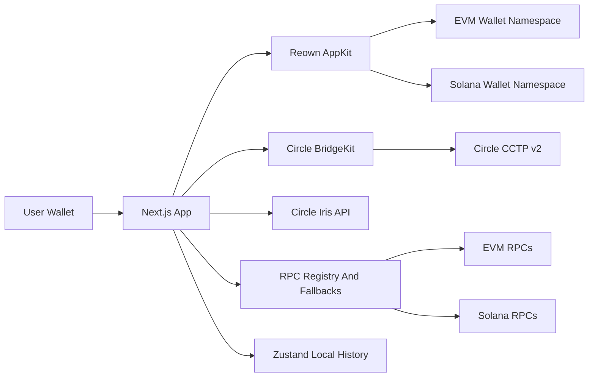

# CaptainBridge

<p align="center">
  <strong>Native USDC cross-chain transfer, powered by Circle CCTP v2.</strong>
</p>

<p align="center">
  <a href="https://github.com/Adidas8023/CaptainBridge">
    
  </a>
  
  
  
  
</p>

<p align="center">
  <a href="#中文">中文</a>
  <span> | </span>
  <a href="#english">English</a>
</p>

---

## 目录

- [中文](#中文)
  - [项目简介](#项目简介)
  - [核心能力](#核心能力)
  - [支持网络](#支持网络)
  - [技术架构](#技术架构)
  - [本地运行](#本地运行)
  - [Cloudflare 部署](#cloudflare-部署)
  - [环境变量](#环境变量)
  - [安全与提交规则](#安全与提交规则)
  - [常用命令](#常用命令)
- [English](#english)
  - [Overview](#overview)
  - [Highlights](#highlights)
  - [Supported Networks](#supported-networks)
  - [Architecture](#architecture)
  - [Local Development](#local-development)
  - [Cloudflare Deployment](#cloudflare-deployment)
  - [Environment Variables](#environment-variables)
  - [Security And Git Hygiene](#security-and-git-hygiene)
  - [Scripts](#scripts)

---

## 中文

### 项目简介

CaptainBridge 是一个基于 **Next.js 16**、**Circle CCTP v2**、**Reown AppKit** 的原生 USDC 跨链桥。项目聚焦一件事：让 EVM 链和 Solana 之间的 USDC 转账路径更直接、更少错误、更容易确认状态。

它不是托管桥，也不保存私钥。钱包连接、签名、网络切换都发生在用户浏览器和钱包里。

### 核心能力

| 能力 | 说明 |
| --- | --- |
| 原生 USDC 跨链 | 使用 Circle CCTP v2 burn and mint 流程 |
| EVM + Solana 钱包 | EVM 和 Solana namespace 分开管理，可同时连接 |
| 自动网络切换 | 源链是 EVM 且网络不匹配时，CTA 会提示切换 |
| 目标钱包检查 | 目标链钱包未连接时，CTA 会拉起对应钱包连接 |
| 手动领取 | 支持输入源链交易哈希，检测 attestation 后领取 |
| 历史记录 | 本地保存跨链记录，可刷新待完成交易状态 |
| RPC fallback | 环境变量优先，Alchemy 可选，公共节点兜底 |

### 支持网络

当前配置共 **23** 条主网：

| EVM | Solana |
| --- | --- |
| Ethereum, Avalanche, OP Mainnet, Arbitrum One, Base, Polygon, Unichain, Linea Mainnet, Codex, Cronos, Sonic, World Chain, Monad, Sei Network, XDC Network, HyperEVM, Ink, Plume, Edge, Injective, Morph, Pharos | Solana |

> Starknet 当前不在范围内。

### 技术架构



主要代码入口：

| 路径 | 用途 |
| --- | --- |
| `src/components/bridge/BridgeCard.tsx` | 跨链表单、CTA 状态、钱包提示 |
| `src/lib/hooks/useBridge.ts` | BridgeKit 流程、领取流程、历史记录写入 |
| `src/lib/hooks/useWallet.ts` | EVM/Solana 钱包连接和网络切换 |
| `src/lib/hooks/useBalance.ts` | USDC 余额读取和缓存 |
| `src/lib/cctp/*` | CCTP 合约、Iris API、Solana instruction |
| `src/config/rpc.ts` | RPC 优先级和 fallback |
| `src/components/providers/AppProviders.tsx` | Reown AppKit、Wagmi、Solana adapter |

### 本地运行

```bash
git clone https://github.com/Adidas8023/CaptainBridge.git
cd CaptainBridge
npm install
cp .env.example .env.local
npm run dev
```

打开：

```text
http://localhost:3000
```

生产构建：

```bash
npm run build
npm run start
```

### Cloudflare 部署

项目使用 Cloudflare Workers + OpenNext，生产域名已在 `wrangler.jsonc` 配置为：

```text
https://bridge.abelai.app
```

部署前确保 `abelai.app` 已接入当前 Cloudflare 账户，且 `bridge.abelai.app` 没有冲突的 CNAME。`NEXT_PUBLIC_REOWN_PROJECT_ID` 是构建期变量，必须在构建前设置。

```bash
npm run cf:typegen
npm run cf:build
npm run preview
npm run deploy
```

`npm run preview` 使用 Cloudflare `workerd` 运行时；部署前应至少完成一次该预览验证。

### 环境变量

最少需要：

```bash
NEXT_PUBLIC_REOWN_PROJECT_ID=your_reown_project_id
```

可选：

```bash
NEXT_PUBLIC_ALCHEMY_API_KEY=
NEXT_PUBLIC_SOLANA_RPC_URL=
NEXT_PUBLIC_ETHEREUM_RPC_URL=
NEXT_PUBLIC_BASE_RPC_URL=
```

完整列表见 [.env.example](./.env.example)。`.env.local` 会被 `.gitignore` 排除，不要提交真实 key。

### 安全与提交规则

提交前请确认：

- 不提交 `.env.local`、`.env.*`、私钥、助记词、RPC 私密 key。
- 不提交 `node_modules/`、`.next/`、`out/`、`.vercel/`。
- `.env.example` 只能放占位符或公开 RPC。
- 钱包签名只在用户钱包内完成，项目不要求后端保存私钥。
- 如果使用私有 RPC，请只放在本地 `.env.local` 或部署平台的环境变量里。

### 常用命令

| 命令 | 说明 |
| --- | --- |
| `npm run dev` | 启动开发服务 |
| `npm run build` | 生产构建 |
| `npm run start` | 启动生产服务 |
| `npm run lint` | ESLint 检查 |
| `npm audit --omit=dev` | 检查生产依赖安全报告 |

---

## English

### Overview

CaptainBridge is a native USDC bridge built with **Next.js 16**, **Circle CCTP v2**, and **Reown AppKit**. It focuses on a simple goal: make EVM and Solana USDC transfers clear, direct, and easier to recover when a claim needs manual follow-up.

The app is non-custodial. It does not store private keys. Wallet connection, signing, and network switching happen inside the user's browser and wallet.

### Highlights

| Capability | Description |
| --- | --- |
| Native USDC transfers | Circle CCTP v2 burn and mint flow |
| EVM + Solana wallets | Explicit wallet namespaces, simultaneous connection supported |
| Network switching | CTA guides EVM users to the correct source chain |
| Destination wallet checks | CTA opens the right wallet connector when the destination wallet is missing |
| Manual claim | Paste a source transaction hash, detect attestation, then claim |
| Local history | Persist bridge records locally and refresh pending status |
| RPC fallback | Environment RPC first, optional Alchemy, public fallback last |

### Supported Networks

The current mainnet registry includes **23** networks:

| EVM | Solana |
| --- | --- |
| Ethereum, Avalanche, OP Mainnet, Arbitrum One, Base, Polygon, Unichain, Linea Mainnet, Codex, Cronos, Sonic, World Chain, Monad, Sei Network, XDC Network, HyperEVM, Ink, Plume, Edge, Injective, Morph, Pharos | Solana |

> Starknet is intentionally out of scope for now.

### Architecture


Key files:

| Path | Purpose |
| --- | --- |
| `src/components/bridge/BridgeCard.tsx` | Bridge form, CTA states, wallet guidance |
| `src/lib/hooks/useBridge.ts` | BridgeKit flow, claim flow, history writes |
| `src/lib/hooks/useWallet.ts` | EVM/Solana connection and network switching |
| `src/lib/hooks/useBalance.ts` | USDC balance reads and cache |
| `src/lib/cctp/*` | CCTP contracts, Iris API, Solana instructions |
| `src/config/rpc.ts` | RPC priority and fallback registry |
| `src/components/providers/AppProviders.tsx` | Reown AppKit, Wagmi, Solana adapter setup |

### Local Development

```bash
git clone https://github.com/Adidas8023/CaptainBridge.git
cd CaptainBridge
npm install
cp .env.example .env.local
npm run dev
```

Open:

```text
http://localhost:3000
```

Production build:

```bash
npm run build
npm run start
```

### Cloudflare Deployment

The app uses Cloudflare Workers with OpenNext. The production custom domain is configured in `wrangler.jsonc`:

```text
https://bridge.abelai.app
```

Before deployment, ensure `abelai.app` is active in the current Cloudflare account and that no conflicting CNAME exists for `bridge.abelai.app`. `NEXT_PUBLIC_REOWN_PROJECT_ID` is required at build time.

```bash
npm run cf:typegen
npm run cf:build
npm run preview
npm run deploy
```

`npm run preview` executes the app in Cloudflare's `workerd` runtime and should pass before production deployment.

### Environment Variables

Minimum required value:

```bash
NEXT_PUBLIC_REOWN_PROJECT_ID=your_reown_project_id
```

Optional values:

```bash
NEXT_PUBLIC_ALCHEMY_API_KEY=
NEXT_PUBLIC_SOLANA_RPC_URL=
NEXT_PUBLIC_ETHEREUM_RPC_URL=
NEXT_PUBLIC_BASE_RPC_URL=
```

See [.env.example](./.env.example) for the full list. `.env.local` is ignored by git and must not contain committed production keys.

### Security And Git Hygiene

Before pushing:

- Do not commit `.env.local`, `.env.*`, private keys, seed phrases, or private RPC keys.
- Do not commit `node_modules/`, `.next/`, `out/`, or `.vercel/`.
- Keep `.env.example` limited to placeholders and public RPC endpoints.
- Wallet signatures stay inside the user's wallet.
- Put private RPC credentials only in local `.env.local` or deployment environment variables.

### Scripts

| Command | Description |
| --- | --- |
| `npm run dev` | Start the local development server |
| `npm run build` | Build for production |
| `npm run start` | Start the production server |
| `npm run lint` | Run ESLint |
| `npm audit --omit=dev` | Review production dependency advisories |
